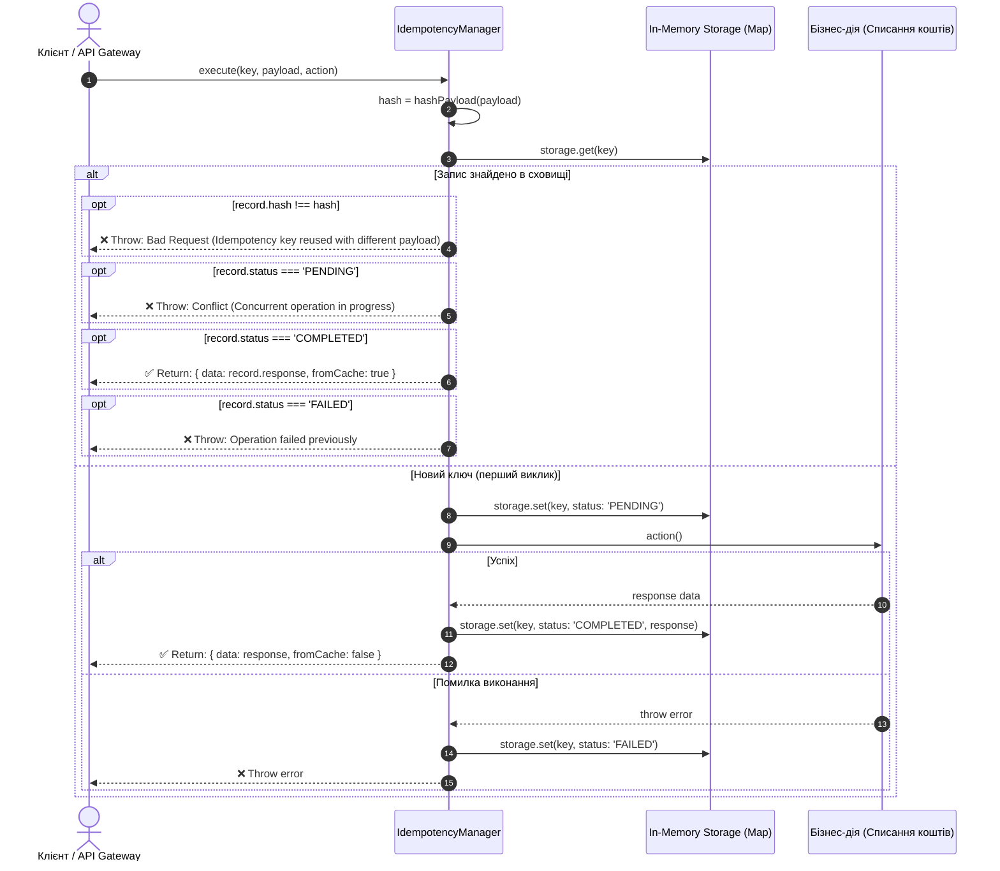

# 🎯 Project 3 Day 13 Answers: Event-Driven — Надійність розподілених систем (Outbox Pattern & Idempotency)

Цей документ містить практичне резюме виконаного Завдання 1 ([index.day_13.ts](../../index.day_13.ts)), поглиблений аналіз алгоритму ідемпотентності з детермінованим SHA-256 хешуванням, а також вичерпні відповіді на питання для самоперевірки та технічного інтерв'ю із завдання [p-3_d-4.md](../tasks/p-3_d-4.md).

---

## 🧩 Практичне резюме: Завдання 1. Алгоритмічний розігрів (Idempotency Manager with Deterministic Hashing)

Код реалізації та демонстраційні тести знаходяться у файлі [index.day_13.ts](../../index.day_13.ts).

### 🎯 Мета завдання

1. Реалізувати універсальний менеджер ідемпотентності ([IdempotencyManager](../../index.day_13.ts#L18)) на TypeScript, що захищає бізнес-критичні операції (наприклад, списання коштів чи розміщення замовлення) від повторного виконання через дублюючі мережеві запити.
2. Розробити алгоритм **детермінованої канонізації JSON** ([canonicalize](../../index.day_13.ts#L21)), який нормалізує об'єкти з довільним порядком ключів і обчислює криптографічний хеш **SHA-256** ([hashPayload](../../index.day_13.ts#L40)).
3. Реалізувати машину станів (`PENDING` $\to$ `COMPLETED` / `FAILED`) із блокуванням паралельних конкурентних запитів (**Conflict 409**) та кешуванням результатів успішних операцій.
4. Забезпечити сувору валідацію на випадок повторного використання одного й того ж ключа з різним тілом запиту (**Bad Request**).

---

### 🛠️ Архітектура рішення та покроковий розбір коду

#### 1. Чому звичайний `JSON.stringify` не є детермінованим

У JavaScript та транспортних протоколах (HTTP/JSON) порядок властивостей в об'єктах формально не гарантується:
```javascript
const reqA = { orderId: "ord-42", amount: 150 };
const reqB = { amount: 150, orderId: "ord-42" };

JSON.stringify(reqA); // '{"orderId":"ord-42","amount":150}'
JSON.stringify(reqB); // '{"amount":150,"orderId":"ord-42"}'
```
Якщо рахувати SHA-256 від сирих рядків, ці запити отримають різні хеші, що призведе до катастрофічного подвійного списання (Double-charge).

#### 2. Алгоритм детермінованої канонізації (`canonicalize`)

Щоб гарантувати ідентичність рядків, структура об'єкта піддається рекурсивній нормалізації:

```typescript
static canonicalize(value: unknown): unknown {
  // Базовий випадок: примітиви (string, number, boolean) та null повертаються як є
  if (value === null || typeof value !== "object") {
    return value;
  }

  // Масиви: порядок елементів фіксований, але кожен елемент канонізується рекурсивно
  if (Array.isArray(value)) {
    return value.map((item) => this.canonicalize(item));
  }

  // Об'єкти: сортування ключів за алфавітом та рекурсивна обробка значень
  return Object.fromEntries(
    Object.keys(value)
      .toSorted()
      .map((key) => [
        key,
        this.canonicalize((value as Record<string, unknown>)[key]),
      ]),
  );
}
```

- **Примітиви:** повертаються без змін, оскільки вони атомарні.
- **Масиви:** порядок елементів зберігається (`[1, 2] !== [2, 1]`), але вкладені об'єкти нормалізуються.
- **Об'єкти:** ключі сортуються через `Object.keys(value).toSorted()`, після чого конструюється новий об'єкт через `Object.fromEntries()`. Порядок вставки ключів стає стабільним і алфавітним.

#### 3. Обчислення хешу SHA-256 (`hashPayload`)

```typescript
static hashPayload(payload: unknown): string {
  const canonicalized = this.canonicalize(payload);

  return createHash("sha256")
    .update(JSON.stringify(canonicalized))
    .digest("hex");
}
```
Хеш фіксованої довжини (64 символи в шістнадцятковому форматі) є компактним цифровим відбитком запиту. Це дозволяє ефективно будувати унікальні індекси в БД або ключі в Redis з мінімальним споживанням RAM.

---

### 🔄 Машина станів та життєвий цикл запиту (`execute`)

Життєвий цикл кожного запиту проходить через сувору послідовність перевірок:



#### Захисні бар'єри в реалізації:
1. **Захист від підміни (Payload Mismatch):** Якщо ключ той самий, а `hash` інший — викидається помилка `Bad Request: Idempotency key reused with different payload`.
2. **Захист від конкурентного виклику (Race Condition Guard):** Поки перша дія у процесі виконання (`PENDING`), повторні паралельні запити отримують відхилення `Conflict: Concurrent operation in progress`. Це еквівалент Distributed Lock у Redis (`SET key lock NX PX 5000`).
3. **Ідемпотентне повернення (Cache Hit):** Якщо статус `COMPLETED`, бізнес-функція `action()` взагалі не викликається, а відповідь миттєво повертається з кешу з міткою `fromCache: true`.
4. **Коректне очищення або фіксація збою (`FAILED`):** У блоці `catch` статус запису змінюється на `FAILED`, що фіксує невдалу спробу та запобігає зависанню ключа в стані `PENDING`.

---

### 📊 Результати виконання автоматичного тесту

Тест із файлу [index.day_13.ts](../../index.day_13.ts) запускається командою:
```bash
npx tsx index.day_13.ts
```

**Фактичний лог консолі:**
```text
--- Attempt 1: First call ---
[Business Logic] Actual debit of $150 for order ord-42...
Result 1: {
  data: { transactionId: 'tx-1789459254635', amount: 150 },
  fromCache: false
}
--- Attempt 2: Repeat call due to network failure ---
Result 2 (from cache): {
  data: { transactionId: 'tx-1789459254635', amount: 150 },
  fromCache: true
}
✅ Idempotency manager test passed!
```

Всі асерти (`actualExecutionCount === 1`, `res2.fromCache === true`, збіг `transactionId`) виконані на 100%.

---

## 🎯 Відповіді на питання для самоперевірки та інтерв'ю

---

### 1. Гарантія At-least-once та необхідність Idempotent Consumer

#### Питання:
*Чому патерн Transactional Outbox забезпечує саме гарантію доставки **At-least-once** (хоча б один раз), а не Exactly-once? Що відбудеться, якщо повідомлення успішно надіслано в брокер, але сервер вимкнувся до коміту оновлення статусу в `outbox_events`? Чому кожен споживач зобов'язаний бути ідемпотентним?*

#### Відповідь:

#### 1. Анатомія гарантії At-least-once в Transactional Outbox
Патерн Outbox гарантує, що повідомлення **ніколи не загубиться** (усуває Dual-Write збій), оскільки бізнес-сутність і запис про подію фіксуються в одній ACID-транзакції реляційної БД. Проте доставка у брокер реалізується фоновим воркером у два кроки:
1. **Крок 1:** Воркер вичитує запис із `outbox_events` і надсилає повідомлення в брокер (Kafka/RabbitMQ).
2. **Крок 2:** Брокер повертає успішний ACK $\to$ воркер оновлює статус запису на `PUBLISHED` (або видаляє рядок) у БД.

```
+---------------+        1. Publish Event        +-----------------+
| Outbox Worker | -----------------------------> | Kafka Broker    |
|               | <----------------------------- | (Message Saved) |
+---------------+           Broker ACK           +-----------------+
       |
       | 💥 CRASH! Сервер знеструмлено до виконання оновлення БД!
       v
+-------------------------------+
| DB: outbox_events             |
| id: 101, status: 'PENDING'    | <--- Статус залишився незмінним!
+-------------------------------+
```

#### 2. Що станеться після рестарту:
- Коли Outbox-воркер перезапуститься, він знову побачить у базі подію з `id: 101` у статусі `PENDING`.
- Воркер **повторно надішле** це повідомлення в брокер.
- У результаті в топіку Kafka опиняться **два однакових повідомлення** (дублікати). Саме тому патерн забезпечує доставку *«хоча б один раз» (At-least-once)*, але не може самотужки забезпечити *«рівно один раз» (Exactly-once)*.

#### 3. Чому споживач (Consumer) зобов'язаний бути ідемпотентним:
У розподілених системах неможливо гарантувати мережеву доставку строго один раз без участі споживача (теорема про двох генералів). Якщо споживач не має захисту від дублікатів:
- Повторна обробка події `OrderPaid` спричинить повторне відвантаження товару чи подвійне нарахування бонусів.
- **Idempotent Consumer Pattern:** Кожен споживач зберігає унікальний ідентифікатор обробленого повідомлення (`message_id` або `event_id`) у таблиці `processed_messages` або в Redis. Перед виконанням логіки перевіряється наявність `message_id`: якщо повідомлення вже оброблялося — воно просто підтверджується (ACK) і пропускається.

---

### 2. Polling Outbox проти Change Data Capture (CDC / Debezium)

#### Питання:
*У чому полягають недоліки періодичного опитування таблиці Outbox через SQL (`SELECT ... FOR UPDATE`) при обсягах у сотні тисяч транзакцій на секунду (навантаження на диск, CPU, затримка між опитуваннями)? Як інструменти класу Debezium реалізують Outbox через читання Write-Ahead Log (WAL) PostgreSQL без додаткових запитів до БД?*

#### Відповідь:

#### Порівняльна таблиця підходів:

| Критерій | Polling Outbox Worker (SQL-опитування) | Change Data Capture (CDC / Debezium) |
| :--- | :--- | :--- |
| **Механізм отримання даних** | Періодичний SQL-запит (`SELECT ... FOR UPDATE SKIP LOCKED`). | Асинхронне читання бінарного журналу передзапису (**WAL**). |
| **Навантаження на БД** | **Високе**: постійні запити навантажують CPU, буферний пул та диск. | **Мінімальне (Near-Zero)**: Debezium не виконує важких `SELECT` або блокувань таблиці. |
| **Затримка (Latency)** | Дискретна: залежить від інтервалу таймера (зазвичай 500–2000 мс). | Субмілісекундна (Streaming): подія потрапляє в брокер за десятки мілісекунд після коміту. |
| **Пропускна здатність** | Обмежена IOPS та блокуваннями (тисячі подій/сек). | Сотні тисяч подій на секунду без деградації бази. |
| **Складність інфраструктури** | **Низька**: лише фоновий сервіс на Node.js/Go. | **Середня/Висока**: потрібен Kafka Connect, плагін `pgoutput` та моніторинг реплікаційних слотів. |

```
1. Polling Outbox:
[DB Table: outbox] <=== SELECT FOR UPDATE (кожні 500мс) === [Worker] ===> [Kafka]

2. CDC (Debezium):
[App] ---> [PostgreSQL ACID Commit] ---> [WAL (Write-Ahead Log)]
                                                |
                                      (Streaming Replication)
                                                v
                                        [Debezium CDC] ===> [Kafka]
```

#### Недоліки Polling Outbox при екстремальних навантаженнях:
1. **CPU & I/O Overhead:** Опитування порожньої або напівпорожньої таблиці кожні кілька сотень мілісекунд спалює ресурси БД.
2. **Конкуренція за блокування:** При багатьох репліках воркерів сотні потоків змагаються за блокування рядків у спільній таблиці.
3. **Table Bloat & VACUUM:** Масові `UPDATE / DELETE` мільйонів записів щодня створюють гігабайти «мертвих кортежів» (Dead Tuples) у PostgreSQL.

#### Як Debezium читає Write-Ahead Log (WAL):
- Будь-яка транзакція в PostgreSQL перед фіксацією на диску спочатку послідовно записується в бінарний журнал передзапису — **WAL** (Write-Ahead Log).
- Debezium підключається до PostgreSQL як звичайний клієнт логічної реплікації (використовуючи плагін `pgoutput`).
- База даних сама стрімить бінарний потік змін журналів у Debezium.
- Debezium парсить події вставки у таблицю `outbox_events` прямо на льоту й асинхронно відправляє їх у відповідні топіки Kafka, взагалі **не створюючи навантаження на таблиці бази даних**.

---

### 3. Конструкція `SKIP LOCKED` в реляційних базах

#### Питання:
*Яка різниця між `FOR UPDATE` та `FOR UPDATE SKIP LOCKED`? Чому використання звичайного `FOR UPDATE` у фонових воркерах призводить до взаємних блокувань (Deadlocks) та простою паралельних процесів?*

#### Відповідь:

#### 1. Порівняння поведінки блокувань

- **`FOR UPDATE` (Песимістичне очікування):**
  Коли процес А виконує `SELECT ... FOR UPDATE LIMIT 10`, він блокує перші 10 рядків. Якщо в цей же момент процес Б виконує такий самий запит, процес Б **повністю блокується і зависає в очікуванні**, доки процес А не зробить `COMMIT` або `ROLLBACK`. 
- **`FOR UPDATE SKIP LOCKED` (Конкурентна черга без блокувань):**
  Коли процес Б намагається вибрати рядки, база бачить, які записи вже заблоковані процесом А, **пропускає їх** і повертає процесу Б наступні вільні записи.

```
Таблиця outbox_events:
[Рядок 1 (Вільний)] -> Захоплено Воркером 1 (LOCK)
[Рядок 2 (Вільний)] -> Захоплено Воркером 1 (LOCK)
[Рядок 3 (Вільний)] -> Пропущено Воркером 2! Захоплено Воркером 2 (LOCK)
[Рядок 4 (Вільний)] -> Пропущено Воркером 2! Захоплено Воркером 2 (LOCK)
```

#### 2. Чому звичайний `FOR UPDATE` призводить до збоїв у воркерах:
1. **Простій та серіалізація паралелізму:** Замість одночасної обробки 5 паралельних воркерів шикуються в чергу і чекають завершення найповільнішого з них. Швидкість опрацювання черги падає до швидкості одного процесу.
2. **Взаємні блокування (Deadlocks):**
   Якщо воркер 1 оновлює записи у порядку `ID: 10 $\to$ 20`, а воркер 2 випадково захоплює `ID: 20 $\to$ 10`, транзакції опиняються у стані Deadlock, і СУБД аварійно вбиває одну з них (`ERROR: deadlock detected`).
3. **`SKIP LOCKED` як нативна черга:** Конструкція `SELECT id FROM outbox_events WHERE status = 'PENDING' ORDER BY id LIMIT 50 FOR UPDATE SKIP LOCKED` перетворює реляційну таблицю на високопродуктивну, потокобезпечну чергу завдань.

---

### 4. Очищення та архівування Outbox таблиці

#### Питання:
*Якщо таблиця `outbox_events` щодня поповнюється мільйонами записів, вона починає деградувати за швидкістю через Table Bloat. Які існують найкращі практики управління розміром таблиці Outbox (Partitioning за датою, фоновий cron-клінер для `status = 'PUBLISHED'`, архівування в S3/ClickHouse)?*

#### Відповідь:

При обсязі в мільйони записів на добу стандартний `DELETE FROM outbox_events WHERE status = 'PUBLISHED'` призводить до деградації: у PostgreSQL зростає кількість "мертвих кортежів" (Dead Tuples), індекси роздуваються (**Index Bloat**), а процес `autovacuum` створює колосальне навантаження на диск.

#### Найкращі практики управління життєвим циклом Outbox:

```
                  +-------------------------------+
                  | PostgreSQL: outbox_events     |
                  +-------------------------------+
                                  |
            +---------------------+---------------------+
            |                                           |
            v                                           v
[Гарячі дані (Hot Storage)]                 [Холодні дані (Cold Storage)]
  Партиціонування за днями                     Архівування через S3 / ClickHouse
  Partition 2026-09-14                         Аналітика та аудит
  Partition 2026-09-15
            |
      DROP PARTITION (Миттєво за O(1))
```

#### 1. Секціонування таблиці за часом (Table Partitioning by Range):
- Таблиця розбивається на секції за днями:
  ```sql
  CREATE TABLE outbox_events (
      id BIGSERIAL,
      payload JSONB,
      created_at TIMESTAMPTZ NOT NULL,
      status VARCHAR(20)
  ) PARTITION BY RANGE (created_at);
  ```
- Для очищення застарілих даних за минулий тиждень виконується:
  ```sql
  DROP TABLE outbox_events_y2026m09d07;
  ```
- **Перевага:** Операція `DROP TABLE` виконується миттєво за **$O(1)$**, оскільки файл просто видаляється з файлової системи Linux, не навантажуючи журнал транзакцій, `autovacuum` та індекси.

#### 2. Пакетне видалення (Batch Delete Cleaner):
Якщо секціонування не налаштоване, очищення ніколи не роблять одним великим `DELETE` (це заблокує таблицю і переповнить пам'ять транзакцій). Замість цього запускають фоновий процес, який видаляє записи пачками:
```sql
DELETE FROM outbox_events
WHERE id IN (
    SELECT id FROM outbox_events
    WHERE status = 'PUBLISHED' AND created_at < NOW() - INTERVAL '1 day'
    LIMIT 5000
);
```
Між батчами робиться пауза (наприклад, 100 мс), що дає процесу `autovacuum` можливість вчасно очищати сторінки.

#### 3. Архівування в аналітичні сховища (S3 / ClickHouse):
Якщо бізнес вимагає зберігати аудит усіх подій протягом кількох років:
- Замість зберігання старих подій у дорогій оперативній пам'яті та SSD транзакційної бази (PostgreSQL), воркер або CDC-пайплайн паралельно копіює опубліковані події в **AWS S3 / MinIO** у форматі Apache Parquet або стрімить у колоночну СУБД **ClickHouse**.
- Це зменшує витрати на зберігання в 10–20 разів і залишає робочу базу PostgreSQL компактною та швидкою.
