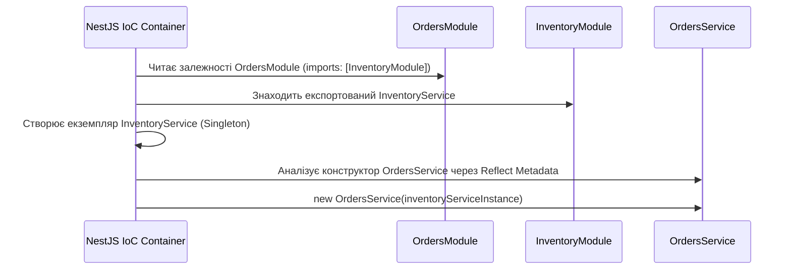

# 🎯 Відповіді на питання для самоперевірки та співбесіди

Цей документ містить глибокі розбори теоретичних та практичних питань із завдання ([task.md](file:///home/bohdan/MyProjects/test_projects/order-inventory-service/docs/task.md)).

---

## 1. Чим `Record<K, T>` відрізняється від index signature `{[key: string]: T}`?

### 📌 Коротке резюме
* **Index Signature (`{ [key: string]: T }`)** описує **відкритий набір ключів**. Він стверджує: *«будь-який можливий рядок може бути ключем цього об'єкта»*.
* **`Record<K, T>`** — це утилітарний тип на базі **Mapped Types**, який дозволяє задати **чітко визначений, фіксований або обмежений набір ключів** (наприклад, конкретний `union` рядків).

---

### 🔍 Детальні відмінності

#### 1. Обмеження ключів до конкретного `union` літералів
Спроба задати фіксований набір ключів через index signature викличе помилку компіляції:
```typescript
// ❌ Помилка компіляції TS1337: An index signature parameter type cannot be a literal type or generic type.
type StatusMap = {
  [key: 'pending' | 'success' | 'failed']: string;
};
```
Натомість `Record<K, T>` спроєктований саме для цього:
```typescript
// ✅ Повністю валідно:
type Status = 'pending' | 'success' | 'failed';
type StatusMap = Record<Status, string>;

// TypeScript зобов'яже оголосити ВСІ ключі з union:
const labels: StatusMap = {
  pending: 'В очікуванні',
  success: 'Виконано',
  failed: 'Помилка',
};
```

#### 2. Строгість перевірки типів
| Критерій | `{ [key: string]: T }` | `Record<'a' \| 'b', T>` |
| :--- | :--- | :--- |
| **Ключі** | Нескінченна множина рядків | Фіксована множина (`'a'` та `'b'`) |
| **Обов'язковість** | Ключі не є обов'язковими (об'єкт може бути порожнім `{}`) | Усі вказані ключі **обов'язкові** за замовчуванням |
| **Автодоповнення (Autocomplete)** | Відсутнє у IDE для ключів | Повне автодоповнення для кожного ключа |
| **Поведінка під час доступу** | `obj['anyKey']` має тип `T` (хоча в рантаймі там `undefined`, якщо не увімкнено `noUncheckedIndexedAccess`) | `obj.a` гарантовано повертає `T` |

#### 3. Як влаштований `Record` всередині TypeScript:
```typescript
type Record<K extends keyof any, T> = {
  [P in K]: T;
};
```
Тут використовується оператор `in`, який дозволяє ітеруватися по типах-літералах (`P in K`), що неможливо зробити у звичайному `[key: Type]`.

---

## 2. Як працюють utility types `Pick`, `Omit`, `Partial`, `Required` на рівні Generics?

Усі ці типи побудовані на комбінації:
1. **Mapped Types** (`[P in keyof T]`) — прохід циклом по ключах об'єкта.
2. **Indexed Access Types** (`T[P]`) — отримання типу значення за його ключем.
3. **Модифікаторів** `?` (додати опціональність) та `-?` (видалити опціональність).
4. **Conditional Types** (`T extends U ? X : Y`) — фільтрація типів.

---

### 🛠 Власна реалізація `MyPartial<T>`
`Partial<T>` робить усі поля об'єкта опціональними:

```typescript
type MyPartial<T> = {
  [P in keyof T]?: T[P];
};

// Приклад:
interface User {
  id: string;
  name: string;
}

type PartialUser = MyPartial<User>;
// Результат: { id?: string; name?: string; }
```
* **`keyof T`**: повертає union усіх ключів інтерфейсу (`'id' | 'name'`).
* **`[P in keyof T]`**: ітерується по кожному ключу `P`.
* **`?:`**: додає модифікатор опціональності до кожної властивості.
* **`T[P]`**: витягує оригінальний тип поля (для `id` це `string`).

---

### 🛠 Власна реалізація `MyRequired<T>`
`Required<T>` робить усі поля строго обов'язковими, видаляючи знак `?`:

```typescript
type MyRequired<T> = {
  [P in keyof T]-?: T[P];
};
```
* Оператор **`-?`** видаляє модифікатор опціональності з кожного поля.

---

### 🛠 Власна реалізація `MyPick<T, K>`
`Pick<T, K>` вибирає лише вказані ключі `K` з типу `T`:

```typescript
type MyPick<T, K extends keyof T> = {
  [P in K]: T[P];
};

// Приклад:
type UserNameOnly = MyPick<User, 'name'>;
// Результат: { name: string; }
```
* **`K extends keyof T`**: Generic Constraint (обмеження), яке гарантує, що `K` може бути лише тим ключем, який реально існує в `T`.
* **`[P in K]`**: ітеруємося не по всьому `keyof T`, а виключно по переданій підмножині `K`.

---

### 🛠 Власна реалізація `MyOmit<T, K>`
`Omit<T, K>` повертає тип, видаляючи передані ключі `K`:

```typescript
// Допоміжний утилітарний тип: виключає з union T ті елементи, які є в U
type MyExclude<T, U> = T extends U ? never : T;

// Реалізація через Pick та Exclude:
type MyOmit<T, K extends keyof any> = MyPick<T, MyExclude<keyof T, K>>;

// Або сучасний варіант через Key Remapping (TypeScript 4.1+):
type MyOmitModern<T, K extends keyof any> = {
  [P in keyof T as P extends K ? never : P]: T[P];
};
```
* **`as P extends K ? never : P`**: якщо поточний ключ `P` належить до множини `K`, ми перетворюємо його назву на `never`, і TypeScript просто видаляє це поле з фінального об'єкта.

---

## 3. У чому різниця між Dependency Injection (DI) та Inversion of Control (IoC)? Як це реалізовано в NestJS?

### 📌 Теорія понять:
* **Inversion of Control (IoC — Інверсія управління)** — це загальний **архітектурний принцип** (відомий як *«Голлівудський принцип»*: *«Не телефонуйте нам, ми самі вам зателефонуємо»*). 
  - *Без IoC:* ваш клас сам керує створенням екземплярів своїх залежностей (`this.inventoryService = new InventoryService()`).
  - *З IoC:* клас віддає право керування життєвим циклом залежностей зовнішньому фреймворку (IoC-контейнеру).
* **Dependency Injection (DI — Впровадження залежностей)** — це конкретний **патерн проєктування**, за допомогою якого реалізується принцип IoC. Залежності передаються об'єкту ззовні (найчастіше через конструктор — *Constructor Injection*), замість того, щоб він створював їх власноруч.

---

### ⚙️ Як це реалізовано в контейнері NestJS:



1. **Декоратор `@Injectable()`**:
   - Позначає клас як `Provider` (компонент, яким може керувати NestJS).
   - Завдяки увімкненому `emitDecoratorMetadata` у `tsconfig.json`, TypeScript компілює типи параметрів конструктора у метадані JavaScript (`design:paramtypes`).

2. **Constructor Injection**:
   ```typescript
   @Injectable()
   export class OrdersService {
     constructor(private readonly inventoryService: InventoryService) {}
   }
   ```
   `OrdersService` не знає і не турбується про те, як створюється `InventoryService`, які в нього параметри чи конфігурація. Він лише вимагає сумісний інтерфейс.

3. **Граф залежностей (Module Graph)**:
   - Під час запуску застосунку NestJS будує дерево модулів.
   - Бачачи `imports: [InventoryModule]` у `OrdersModule`, контейнер перевіряє `exports: [InventoryService]` у `InventoryModule`.
   - За замовчуванням у NestJS діє область видимості **Singleton**: створюється один спільний екземпляр `InventoryService` на весь застосунок і підставляється у конструктор `OrdersService`.

---

## 4. Навіщо у Docker Compose вказувати `healthcheck` для БД і як `condition: service_healthy` допомагає залежним сервісам?

### ⚠️ Проблема звичайного запуску
За замовчуванням Docker вважає контейнер успішно запущеним (`running`), щойно його головний процес (PID 1) стартував. 

Для PostgreSQL це означає:
1. Контейнер переходить у стан `running` вже за **0.1–0.3 секунди**.
2. Але самій системі PostgreSQL всередині контейнера потрібно ще **2–5 секунд**, щоб:
   - Прочитати конфігураційні файли.
   - Виділити буфери пам'яті (shared memory buffers).
   - Перевірити та відновити WAL (Write-Ahead Logs).
   - Відкрити мережевий порт `5432` для прийому TCP-з'єднань.

Якщо залежний сервіс (наприклад, `pgadmin` або наш `order-service`) запуститься одразу разом з контейнером Postgres, він спробує підключитися в перші ж мілісекунди і **впаде з критичною помилкою**:
`connect ECONNREFUSED 127.0.0.1:5432` або `Connection refused`.

---

### 🛡 Рішення: `healthcheck` + `condition: service_healthy`

```yaml
services:
  postgres_db:
    image: postgres:17-alpine
    healthcheck:
      # Утиліта pg_isready реально намагається підключитися до сокета Postgres:
      test: ["CMD-SHELL", "pg_isready -U ${POSTGRES_USER} -d ${POSTGRES_DB}"]
      interval: 10s
      timeout: 5s
      retries: 5

  pgadmin:
    image: dpage/pgadmin4
    depends_on:
      postgres_db:
        condition: service_healthy # 👈 Ключова директива!
```

#### Як це працює:
1. Контейнер `postgres_db` запускається у стані `starting`.
2. Docker періодично викликає команду `pg_isready`. Поки Postgres ініціалізується, команда повертає помилку.
3. Щойно Postgres готовий приймати підключення, `pg_isready` повертає код **`0`**. Docker переводить контейнер у статус **`healthy`**.
4. Завдяки директиві `condition: service_healthy`, Docker Compose **блокує старт `pgadmin`**, доки статус `postgres_db` не стане `healthy`.
5. `pgadmin` (а в майбутньому і бекенд з TypeORM/Prisma) стартує гарантовано в той момент, коли база даних на 100% готова приймати трафік.
